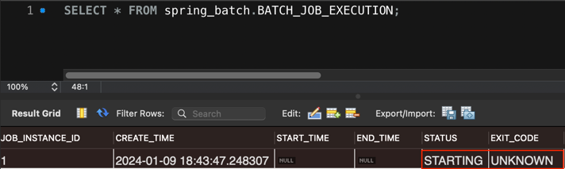
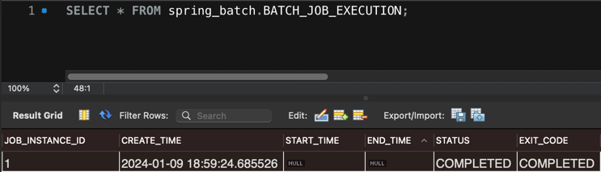

# Implement Your First Job

### 1: Implement Your First Job

`Job`이란 배치 프로세스 전체를 캡슐화한 엔티티입니다.
간단하게 청구 정보를 콘솔에 출력하는 `Job` 구현체를 만들어봅시다.

```java
public class BillingJob implements Job {

	@Override
	public String getName() {
		return "BillingJob";
	}

	@Override
	public void execute(JobExecution execution) {
		System.out.println("processing billing information");
	}
}
```

### 2: Configure the Job

`Job` 구현체를 만들어봤습니다. 이제 애플리케이션 컨텍스트가 이를 `Bean`으로 감지할 수 있도록 해야합니다.

```java

@Configuration
public class BillingJobConfiguration {

	@Bean
	public Job job() {
		return new BillingJob();
	}
}
```

### 3: Run the Job

스프링 부트 애플리케이션을 시작하면 스프링 부트는 애플리케이션 컨텍스트에 정의된 `Job Bean`을 찾아내고, `JobLauncher`를 통해 실행시킵니다.

### 4: Verify the Job

스프링 배치는 `Job` 실행에 대한 기록을 데이터베이스에 남깁니다.



`Job` 상태(status)가 `STARTING`이고, 종료상태(exit code) 값이 `UNKNOWN`입니다.
데이터베이스에 `Job`의 상태를 올바르게 반영하려면 수정이 필요합니다.

```java
public class BillingJob implements Job {

	private final JobRepository jobRepository;

	public BillingJob(JobRepository jobRepository) {
		this.jobRepository = jobRepository;
	}

	@Override
	public String getName() {
		return "BillingJob";
	}

	@Override
	public void execute(JobExecution execution) {
		System.out.println("processing billing information");
		execution.setStatus(BatchStatus.COMPLETED);
		execution.setExitStatus(ExitStatus.COMPLETED);
		jobRepository.update(execution);
	}
}
```

여기서 이해해야 할 것은 `Job`은 자신의 상태를 `JobRepository`에 보고해야할 책임이 있다는 점입니다.
- `Job`이 실행중이라면 배치 상태(batch Status)는 `BatchStatus.STARTED`
- `Job`이 실패한다면 배치 상태(batch Status)는 `BatchStatus.FAILED`
- `Job`이 정상 종료된다면 배치 상태(batch Status)는 `BatchStatus.COMPLETED`, 그리고 종료 상태(exit status)는 `ExitStatus.COMPLETED`

코드를 변경한 후, 배치 애플리케이션을 다시 실행해보면, `Job`의 상태 및 종료 상태는 `COMPLETED`임을 확인할 수 있습니다.



만약, 배치 애플리케이션 수행 도중 에러가 발생하면 어떻게 될까요?

### 5: Handling Errors

